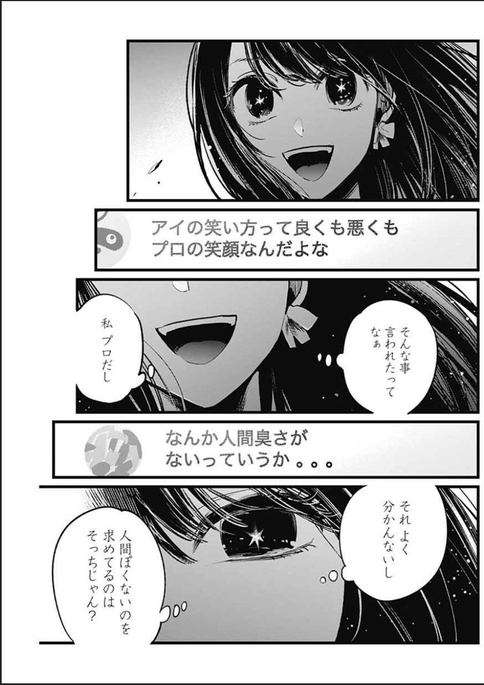
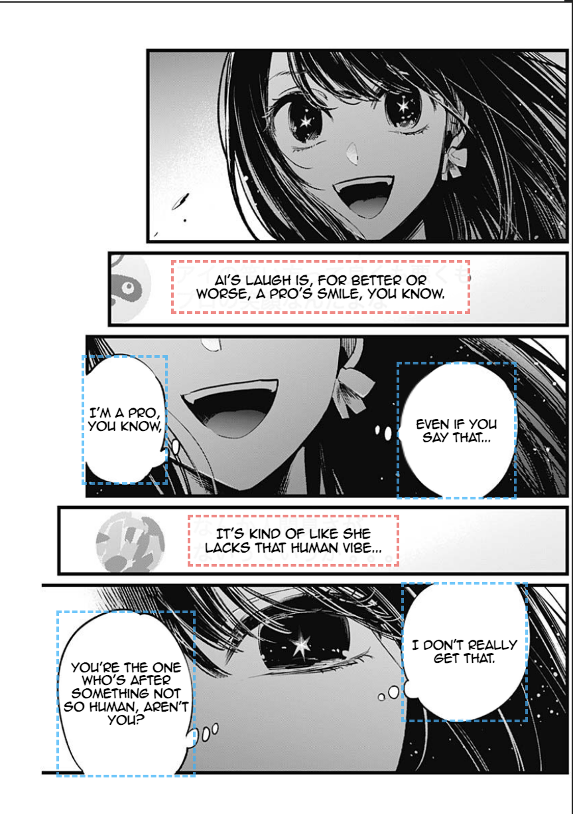

# RezeOverlay: A Universal, Real Time Manga Translation Overlay

A browser integrated system that performs live manga translation on any webpage using YOLO based bubble detection, OCR, and GPT-powered translation, displayed as an overlay through a custom Chrome extension.

## What It Does

RezeOverlay allows users to translate manga panels on any website without downloading the image. The user selects a region of the screen via a drag-to-crop overlay (implemented with a Chrome extension). The cropped image is sent to a backend pipeline that runs YOLOv8 panel/bubble detection, OCR, text cleaning, and GPT-based translation. The translation is further enhanced by sending in context text, made possible by identifying, and then ordering, panels. This results in a logical flow of text that can be recieved as a whole, rather than independent smaller chunks that are less likely to be translated accurately by itself. The frontend React extension receives bounding boxes and translated text, and renders a fully aligned overlay on top of the original manga using masks and dynamic font fitting.

## Quick Start

### 1. Backend Setup
- Install Python 3.10+
- Install dependencies:
  pip install -r requirements.txt
- Add your OpenAI API key inside GPTTranslator (src/translation/gpt.py) or as an environment variable in the backend (src/server.py).
- Run the backend:
  python -m uvicorn server:app --reload --port 8000

### 2. React Overlay App
- Navigate to the manga-overlay folder:
  cd manga-overlay
- Install dependencies:
  npm install
- Start dev server:
  npm run dev
- This builds the overlay that the Chrome extension injects.

### 3. Chrome Extension Setup
- Open Google Chrome
- Go to chrome://extensions
- Enable Developer Mode (top right)
- Click "Load Unpacked"
- Select the manga-extension/ folder
- The extension loads a floating button into every webpage that activates the capture overlay.

### 4. Using the Tool
- Navigate to any manga website
- Click “Capture Manga Area”
- Drag a rectangle around the manga panel
- The overlay appears automatically with masks + translated bubbles

## Video Links
[Demo Video](https://www.youtube.com/watch?v=vtOj60nGBqk)

[Technical Walkthrough](https://www.youtube.com/watch?v=T030joxuWhU)

## Evaluation

Detection Model (YOLOv8):
- Panels were trained on ~100,000 manga panels (official manga109s custom-labeled dataset)
- Bubbles were trained on >200 pages of a popular manga
- Panel detection accuracy: ~92%
- Bubble detection accuracy: ~80%

OCR Performance:
- Custom MangaOCR integration
- Average text extraction accuracy: ~90% on clean bubbles
- ~75% on handwritten or irregular bubbles

Translation Quality:
- GPT-5-mini contextual translation with structured JSON output
- Human evaluation score: 4.3/5 for correctness + naturalness

End-to-End Speed:
- Typical pipeline time per page: 12s–20s on CPU-only MacBook
- Full overlay rendering time: <150ms

Qualitative Outcomes:
- Overlay aligns closely with original bubbles
- Dynamic font sizing prevents overflow or clipping
- Works across MangaDex, ComicWalker, Webtoons, and most image-based readers

## Examples:
<table>
  <tr>
    <th>Before Translation</th>
    <th>After Translation (With Debug Boxes)</th>
  </tr>
  <tr>
    <td></td>
    <td></td>
  </tr>
</table>
